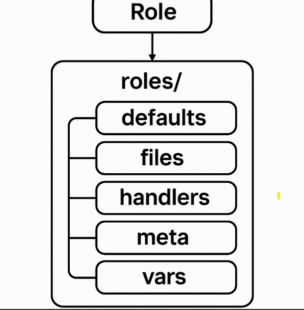

# Introduction to Ansible

Ansible is an open-source IT automation tool that helps you automate tasks such as configuration management, software provisioning, application deployment, and orchestration. It is widely used for managing servers and ensuring consistency across environments.

---

## 🔧 What is Ansible?

Ansible is a simple, agentless automation tool that uses SSH or WinRM to communicate with remote systems. It allows you to automate repetitive tasks using human-readable YAML files called **playbooks**.

---

## ⭐ Key Features

* **Agentless**: No software required on remote systems.
* **Simple YAML Syntax**: Easy-to-write automation scripts.
* **Idempotent**: Ensures the same result even if executed multiple times.
* **Extensible**: Supports various modules for system tasks, cloud, containers, networking, etc.
* **Secure**: Uses secure connection methods (SSH/WinRM).

---

## 🧱 Ansible Architecture

Ansible works using a control node and managed nodes:

* **Control Node**: Machine where Ansible is installed.
* **Managed Nodes**: Machines Ansible manages.
* **Inventory File**: Contains the list of managed nodes.
* **Modules**: Reusable scripts that Ansible executes.
* **Playbooks**: YAML files describing automation tasks.

---

## 📁 Ansible Inventory Example

```ini
[webservers]
web01 ansible_host=192.168.1.10
web02 ansible_host=192.168.1.11

[dbservers]
db01 ansible_host=192.168.1.20
```

---

## 📘 Sample Playbook

```yaml
---
- name: Install Apache Web Server
  hosts: webservers
  become: yes

  tasks:
    - name: Install httpd
      yum:
        name: httpd
        state: present

    - name: Start service
      service:
        name: httpd
        state: started
        enabled: yes
```

---

## 🚀 What Can You Do With Ansible?

* Configure servers
* Install and update software
* Deploy applications
* Manage cloud resources (AWS, Azure, GCP)
* Configure network devices
* Automate CI/CD pipelines

---

## 🏁 Benefits of Using Ansible

* Reduces manual errors
* Saves time by automating repetitive tasks
* Easy to learn and maintain
* Scales well for large environments

---

## 📚 Conclusion

Ansible is a powerful yet simple automation tool suitable for beginners and professionals. Understanding playbooks, modules, and inventory structure gives you the foundation to build complex automation workflows.



---

