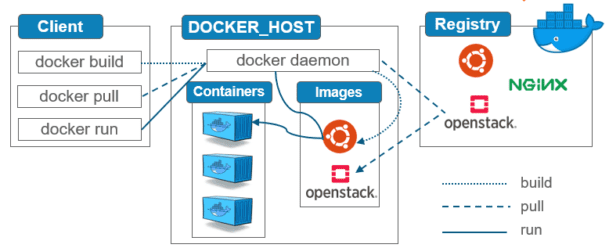

# Docker Architecture

Docker follows a **client–server architecture** that includes the Docker Client, Docker Daemon, Container Runtime, and Registries. Together, these components enable building, running, and managing containerized applications efficiently.

---

## 1. Docker Architecture Overview

Docker Engine consists of:

- **Docker Client**
- **Docker Daemon (dockerd)**
- **Container Runtime (containerd + runc)**
- **Docker Registries**
- **Internal components** such as storage drivers, network drivers, and plugins


---

## 2. Docker Client

The **Docker Client** is the primary interface for interacting with Docker. This is most commonly the Command Line Interface.

It translates user commands like docker ps into REST API requests.
These requests are sent to the Docker Daemon for processing.
A single client can communicate with multiple daemons.

Users run commands such as:

```bash
docker build
docker pull
docker run
```

The client communicates with the Docker Daemon using:

- REST API
- UNIX socket
- TCP socket

### Responsibilities
- Sends user commands to the Docker daemon
- Interacts with registries
- Provides CLI and API interface

---

## 3. Docker Daemon (dockerd)

The **Docker Daemon** performs all heavy operations.

### Responsibilities
- Build Docker images
- Create and manage containers
- Manage networks and volumes
- Handle Docker API requests
- Communicate with containerd

---

## 4. Docker Registries

A **Docker Registry** stores and distributes Docker images.

### Popular Registries
- Docker Hub
- AWS ECR
- Azure ACR
- GitHub Container Registry
- Private registries

### Commands
```bash
docker pull <image>
docker push <image>
```

---

## 5. Container Runtime: containerd & runc

### containerd
- Manages container lifecycle
- Pulls and stores images
- Supervises containers

### runc
- Low-level OCI runtime
- Creates containers using Linux kernel features

### Flow
```
Docker Client → Docker Daemon → containerd → runc → Container
```

---

## 6. How Docker Works (Execution Flow)

1. User runs:
   ```bash
   docker run nginx
   ```
2. Docker Daemon checks for the image locally.
3. If not found, it pulls the image from a registry.
4. containerd prepares container environment.
5. runc launches the container using namespaces & cgroups.
6. Container runs with isolated resources and filesystem.

---

## 7. Kernel Features Used by Docker

| Feature | Description |
|--------|-------------|
| **Namespaces** | Isolates process environment (PID, NET, MNT, IPC, USER) |
| **cgroups** | Limits CPU, memory, disk, network usage |
| **OverlayFS** | Layered filesystem used by images |
| **Capabilities** | Restricts root privileges |

---

## 8. Simple Architecture Diagram (Text)

```
+------------------------+
|     Docker Client      |
+------------+-----------+
             |
             v   (Docker API)
+------------------------+
|     Docker Daemon      |
|  - Manages containers  |
|  - Builds images       |
|  - Networks, Volumes   |
+------------+-----------+
             |
     +-------+-------+
     |               |
     v               v
 Images         Containers
     |
     v
Docker Registry (Hub / Private)
```

---

## 9. Summary

Docker architecture offers:

- **Client** → User interface (CLI/API)
- **Daemon** → Engine that performs operations
- **Registry** → Stores and distributes images
- **containerd + runc** → Run containers using OCI standards

Docker uses:
- Namespaces for isolation
- cgroups for resource limits
- OverlayFS for layered image storage  



